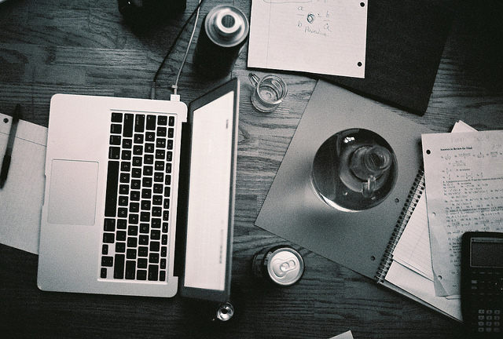

{:height="270px" width="400px"}

# Andy Chase

* [<i class="fa fa-github-alt" aria-hidden="true"></i> github](https://github.com/andychase)
* [<i class="fa fa-flickr" aria-hidden="true"></i>
 flickr](http://www.flickr.com/photos/asperous/sets/)
* [<i class="fa fa-envelope" aria-hidden="true"></i> <theandychase@gmail.com>](mailto:theandychase@gmail.com)
{: #social-links .inline-list}

tech product consultant & developer [[upwork]](https://www.upwork.com/freelancers/~01dbdbcc5a2c375fda)
{: #my-title}



## Employment & Consultancy


-  	
	{:width="16px" height="16px"}
	<a href="{{ job.company_website }}">{{ job.company }}</a>
	
	{{ job.company }}
	{{job.type}} &middot; {{job.when}}
	
{{ job.company_description }}

{: .job-list .inline-list}

## Projects


- 	<a href="{{ project.link }}">{{ project.year }} &middot; {{ project.type }} &middot; {{ project.tech }}</a>
	{: .project-item}
{: .inline-list}

